# Thesis - Automation of router configuration

Description text here

* Automation of router configuration
* Name: Joram Puumala
* E-Mail: a1500947@myy.haaga-helia.fi
* Supervisor: Tero Karvinen
* Haaga-Helia University of Applied Sciences
* Keywords: python, configuration, router, automation, excel

- - -

# Table of Contents

* 1 Introduction
    * 1.1 Background
    * 1.2 About this thesis
    * 1.3 Goals of the study
* 2 Router configuration
	* 2.1 Configuration management
	* 2.2 Web Scraping
	* 2.3 Command line configuration
	* 2.4 Data manipulation with Regular Expressions
	* 2.5 Data conversion
* 3 Current state
	* The current process of router configuration
	* The current process of updating Excel
* 4 Automating the process
	* 4.1 Functions and configuration order
	* 4.2 Initializing SSH connection to router
	* 4.3 Fetching router's serial number and MAC address
	* 4.4 Restoring router's configuration
	* 4.5 Changing SNMP name
	* 4.6 Adding user modules
	* 4.7 Changing root password
	* 4.8 Getting backup file
	* 4.9 Catching errors
	* 4.10 Updating Excel
	* 4.11 Integration
* 5 Results
	* 5.1 Manual configuration
	* 5.2 Automated configuration
	* 5.3 Result comparison and summary
* 6 Future development
* 7 References
* 8 Appendix

# 1 Introduction

## 1.1 Background

Router orders are getting bigger, new customers and services are stirring the soup. NDC Networks is facing a serious problem, they are running out of resources. Router configuration manually is no longer an option.

NDC Networks is a small Finnish company based in Espoo, it was founded in 1993. The company is known for its expertise in networks, Virtual Private Network (VPN) management and router configuration management. Routers that specialists at NDC Networks configure are mostly mobile routers (NDC, 2017). There are currently eight people working at NDC, but the company is expected to grow since its sales have been increasing gradually. NDC's sales have gone up from €1.6 millions (2013) to €2 millions (2016). While there has been a gradual growth in sales, the companys revenue saw a giant growth in 2016, as it went up to 216 000 euros, revenue in 2015 was 90 000 euros and one year earlier 9 000 euros (Finder, 2017).

Different mobile routers do exist, but the basic idea is that it can be connected to a mobile network using a traditional Subscriber Identity Module (SIM) card and is capable of changing its point of attachment to the Internet, moving from one link to another link. Because of the possible different features and demands though, configurations must be unique for each customer (Ernst & Lach, 2007, 5).

## 1.2 About this thesis

This thesis is about finding the best and fastest way to configure Advantech B+B's mobile routers, in massive amounts. The expected outcome is a Python program that can configure the router and update a related excel file. Inside the Python program, shell commands will be used to help in configuration. The routers run Linux (Kernel 3.12.10+) operating system, and the Python version which will be used to run the program is 3.5.2. Two non-native Python modules are needed as well, paramiko (2.3.1) and openpyxl (2.3.0).

There will be lots of code examples. The idea is to build the program step by step and explain what is happening and why something is being done. Because the programm will be built step by step, each function will be tested separately, associated with screenshots of output. In the end when everything seems to work as expected, all the code will be put together and tested. The final program can be found in Appendix and [here](autoconfig.py).

The thesis can be divided into two parts. The first part will give background information about router configuration, what configuration methods exist and how those differ from one another. The second part is the code building and testing, and it will be concluded with results and ideas for future development.

## 1.3 Goals of the study

Main goal of this study is to find out how to speed up the router configuration process.

Research questions are:

- What is the best technology/technique to configure a router in this case and why?
- How much time can be saved, automation vs manual?
- How many fewer errors/misconfigurations will occur?

- - -

# 2 Router configuration, management and techniques

Routers can be configured in different ways, depending on model and manufacturer. Some routers have a fancy Web interface, while other routers can be configured only by using text-based command line. Router configuration using a Web interface is usually pretty straightforward, since Web interfaces are designed so that even laymen have some clue how to configure a router. Router configuration on a command line can be little trickier. Not only because some knowledge of how the command line works is needed, but because commands may change radically between different router operating systems. For example, Cisco, which is dominating router market with share of 55.1% (IDC, 2017), has its own Cisco IOS with unique commands. Then again, Huawei's routers run their own operating system, which means different commands apply when configuring the routers. 


> 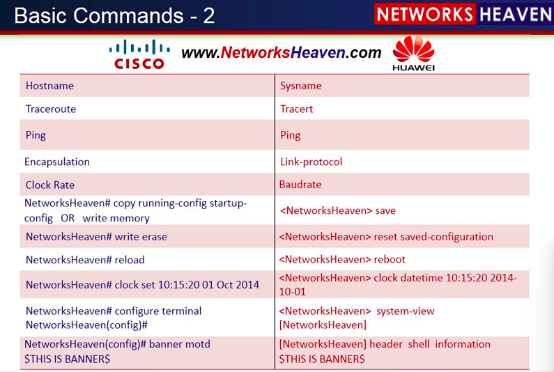

> Fig. 1 - Cisco vs Huawei, Basic Commands - 2 (Khan, 2014)


Since routers can be configured using a Web interface or a command line, the configuration process can be automated. Many vendors also allow scripting on the command line, so this is a giant first step towards automation. Sometimes that is not enough. There may be something that cannot be done or added via a configuration/script file, for example some modules need to be added by hand. This means manual labor and additional time, but the good thing is, it can be automated using external methods. There are different ways to automate such tasks. One way to do it is over an SSH connection, using Python for example. It is also possible to create an automation tool/robot that uses router's Web user interface. The latter technique is called Web scraping (Heydon & Najork, 1999).


## 2.1 Configuration management

Configuration management is a process to handle changes to a system over its life span, and keep it running maintaining its integrity. One of the most important things in configuration management is automation, as it is used to make a system to reach its desirable state (Heidi, 2016). Automation has many benefits over manual configuration, since manual configuration practices are limited in many ways. For example, manual configuration is costly, time-consuming and unscalable. Now imagine having tens of thousands of network elements, and applying a new configuration to every single one by hand. It would be pretty much impossible and eat way too much resources. Also, manual configuration is prone to misinterpretations and errors. Engineering guidelines can be ambiguous, sometimes even imprecise and this leads to multiple interpretations (Enck et al., 2007). Many configuration management tools/systems exist. One should be chosen according to demands that has to be met. Examples of such systems could be Puppet, SolarWinds and SmartWorx Hub.

## 2.2 Web scraping

Extracting patterned data from web pages in the Internet is called Web scraping. There are different uses for Web scraping, one major use is for businesses to track pricing activities of their competitors. Using Web scraping techniques time and labor can be saved in massive amounts. Web scraping can prove itself useful in the realm of research as well (Haddaway, 2015). Web scraping is one way to create an automation tool. It requires a Web user interface for router configuration though.

The basic idea behind a Web scraping framework is that it establishes communication with a user defined Web page using the HTTP protocol, which is a stateless text-based Internet protocol designated to coordinate the request-response transactions between a client and a Web server, in which the client is typically a Web browser. The "User-Agent" header also plays a big role, because it tells the server whether it is trying to be accessed by a robot or a browser. Once the Web scraping framework has retrieved the HTML documents using GET method, contents of interest can be extracted. Because extracting the contents of interest is relevant, regular expressions alone or with a combination of additional logic prove to be powerful and thus are widely adapted. Alternative methods include selector-based languages such as XPath and the CSS selector syntax (Glez-Peña et al., 2014).


> 

> Fig. 2 - Copying CSS selector


Web scraping has some downsides too. It is slower than a simple HTTP request to a web server, because browser waits until the whole Web page is loaded before it allows you to access its elements. What is more, the browser generates more network traffic, which is because of the supplementary files being loaded such as image files, JavaScript and CSS, yet they usually don't prove to be useful. One of the biggest issues is that Web pages do change. This may break your code and you have to fix it to make it work again.

## 2.3 Command line configuration

Configuring a router via command line is the "traditional way", as it is the primary user interface still in use today (Cisco, 2013). Every router has the command line option, but not every router has a Web user interface, which is a one reason why the command line is still preferred. Router configuration on a command line is basically just running a string of commands to change the way a router behaves. Configuration commands usually differ depending on manufacturer.

As it was mentioned earlier, many manufacturers' routers has the option to write configuration scripts. Cisco is a good example. 
Cisco IOS scripting with Tcl is a popular thing, since it would make no sense to run commands one by one. To be able to write scripts for Cisco IOS, one needs to be familiar with Cisco IOS command line commands and Tcl programming (Cisco, 2014). With a Linux based router, Bourne Shell (sh) or Bourne again Shell (bash) may be present, which allows Shell Scripting.

Sometimes something external may be needed. For example, some configuration files and modules need to be transferred to router. Maybe some settings that couldn't be included inside the configuration file/script. A dream situation is that a configuration management system manages it later, unfortunately that's not always the case, and it is always a good practice to make all configurations that are needed as early as possible. Luckily, many routers ship with SSH (configurable or configured), and external scripting can be used over an SSH connection.

- - -

# 3 Current state

There are currently lots of problems in NDC's router configuration. The greatest problem is that everything is done manually using router's graphical Web user interface. After having finished router configuration in the web GUI, Excel documents need to be updated with information such as router's serialnumber, MAC address, IP address and model, also manually.


> 

> Fig. 3 - Routers' Web Interface


## 3.1 The current process of router configuration

1. Plug in the router
2. Browse to its default IP address
3. Log in using username and password
4. Click Restore Configuration
5. Click Add Configuration and browse to the right file
6. Click Add or Update
7. After confirmation takes you to another page, click Back
8. Click Services
9. Click SNMP under Services
10. Change SNMP name
11. Click Apply
12. Click Back
13. Click Change password
14. Type a new password twice
15. Click Apply
16. Click Back
17. Click User Modules
- Currently two user modules are added
18. Click Add new and browse to the right file
19. Click Add or Update
20. Click Back
21. Repeat 18.
22. Repeat 19.
23. Repeat 20.

This is the current process of manual router configuration. The process includes lots of clicking and browsing to files, which obviously takes time. Also, chances are that the person congifuring the router does something wrong and the process has to be started over. Even worse, an inperceptible mistake during the process happens and it has to be debugged and fixed later.

## 3.2 The current process of updating Excel

1. Write router's VPN IP address
2. Write VPN IP address' netmask
3. Write router's serialnumber
4. Write router's MAC address
5. Write router's model
6. Write current date
7. Write sales reference

The Excel has to be updated after a router is configured, so this process is a part of the whole process.


> 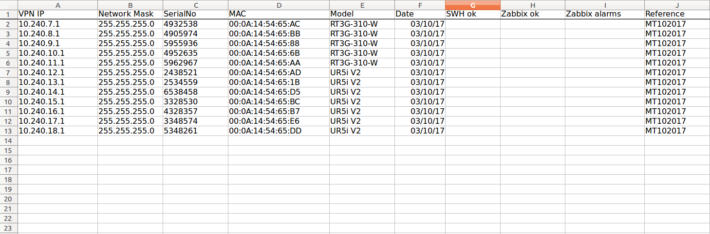

> Fig. 4 - Excel file in which the information above is stored


- - -

# 4 Automating the process

Configuring thousands of routers manually is time consuming and tedious. Humans also tend to make mistakes. A good way to get rid of possible misconfigurations and speed up the process is to automate it. Let computer do all the work. The automation program that will be written for NDC's case, is going to be designed particularly for Advantech B+B's mobile routers, which are running a Linux (Kernel 3.12.10+) operating system with embedded BusyBox software. The Linux operating system doesn't have a package manager. Even though this automation program is designed for Advantech's mobile routers, the idea is that it can be used for other Linux based routers, with only minor changes.

> 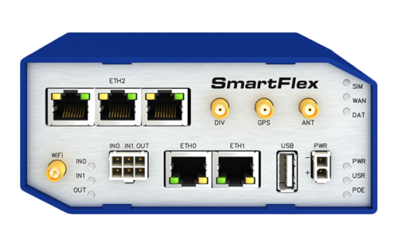

> Fig. 5 - Advantech B+B's SmartFlex mobile router

> 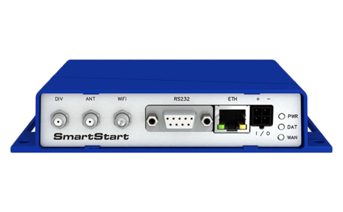

> Fig. 6 - Advantech B+B's SmartStart LTE mobile router

The program will use a command line configuration technique over an SSH (Secure Shell) connection, which it initiates when the program is started. Language of choice is Python (3.5.2), because of its versatility, efficiency and simplicity. Ideally, the program can be run on different operating systems, such as different Linux flavors and Windows versions. The program could also be made using a Web scraping framework, such as Selenium. This option can be deemed little dirty and code fragile, as it can break with minor changes to the Web interface. So, it is a better idea to stick with command line. This configuration is just one time process, since later the router can be managed with Advantech's configuration management system (SmarWorx Hub) and other external scripts using the management system's API, if needed.

## 4.1 Functions and configuration order

Before writing the actual code, it is important to know what has to be written and in which order. For example, router's new configuration file has to be in place before changing its SNMP name, because the new configuration file will overwrite SNMP settings including SNMP name.

Order of functions:
- 1. Initializing SSH connection
- 2. Fetching router's serial number and MAC address
- 3. Put new configuration file into router and run it
- 4. Change SNMP name
- 5. Add user modules
- 6. Change password
- 7. Download backup
- 8. Update excel

- Additionally, for each task a functionality will be written to confirm the success of configuration. 

## 4.2 Initializing SSH connection to router

Firstly, a connection needs to be established between a configuring computer and a router. The computer and the router are connected with an ethernet cable. So, the first step is to write a code snippet that initializes the connection over SSH. Python module "paramiko" will be used, which is a non-native module but can easily be installed using pip (instructions in Appendix).

```python
import paramiko

#default IP for the routers is always the same
router_dflt_ip = "192.168.1.1"
uname = "root"
passwd = "Password3xample-"

#defining the SSH connection
ssh = paramiko.SSHClient()
ssh.set_missing_host_key_policy(paramiko.AutoAddPolicy())
ssh.connect(router_dflt_ip, username=uname, password=passwd)
```

The command "ssh.set_missing_host_key_policy(paramiko.AutoAddPolicy())" is important here because it automatically deals with host keys. To demonstrate what happens without this line, it will be removed for a test run.

> 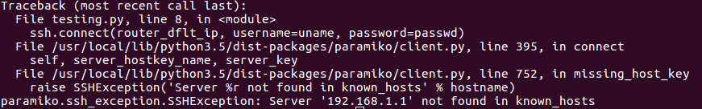

> Fig. 7 - Running the program without "ssh.set_missing_host_key_policy(paramiko.AutoAddPolicy())" line

As it can be seen, "paramiko.ssh_exception.SSHException" was raised. This is because there is a missing host key. Now running the original program should produce different result, because it knows how to deal with the host key.

> 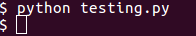

> Fig. 8 - No exceptions are raised this time

This time the program runs without any errors. This means the SSH connection was succesfully created.

## 4.3 Fetching router's serial number and MAC address

In order to fetch a router's serial number, the first thing is to know how to find it inside the router. Fortunately, command "status -v sys" exists. This command prints too much information though, so grep and awk can be used to get just what is needed.

> 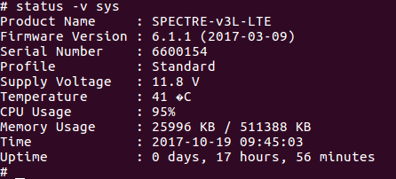

> Fig. 9 - status -v sys command run on router's command line

Now concatenating grep and awk to the command. First thing is to grep for "Serial Number" to get the correct line, after which awk's print function can be used to print the correct column. The fixed command is as follows, "status -v sys |grep "Serial Number" |awk '{print $4}'".

> 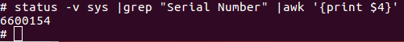

> Fig. 10 - This time, only serial number is printed out to standard output

Knowing how to get router's serial number on the command line, it is time to integrate it with the python program.


```python
import paramiko

#function runs command inside cmd variable on router's command line
#standard output is read and the function returns serial number
def get_serial():
	cmd = "status -v sys |grep \"Serial Number\" |awk '{print $4}'"
	ssh_stdin, ssh_stdout, ssh_stderr = ssh.exec_command(cmd)
	outp = ssh_stdout.readlines()
	serial = outp[0].strip()
	return serial

router_dflt_ip = "192.168.1.1"
uname = "root"
passwd = "Password3xample-"

ssh = paramiko.SSHClient()
ssh.set_missing_host_key_policy(paramiko.AutoAddPolicy())
ssh.connect(router_dflt_ip, username=uname, password=passwd)

#these two lines below are just to confirm that the function
#works as expected.
serial = get_serial()
print(serial)

ssh.close()
```

First the command that prints router's serial number is put into cmd variable. When the command is run on router's command line, all of its output will be stored in ssh_stdout variable. Variable outp is used to store values of ssh_stdout in a tuple, after which the first item that is the serial number is chosen. 


> 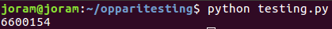

> Fig. 11 - Serial number is returned


It works as expected. Also, now it can be confirmed that an SSH connection was succesfully established between the computer and the router. Another very similar function needs to be created, but this time MAC address of eth0 port will be returned. The MAC address of router's eth0 port can be found running "ifconfig eth0" command. This again, gives too much additional information, so  grep and awk will be used again.


> 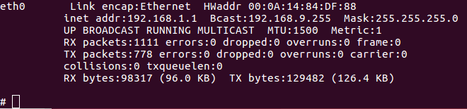

> Fig. 12 - Router's eth0 interface

Concatenation of grep and awk to the original command will do the job; "ifconfig eth0 |grep "HWaddr" |awk '{print $5}'".


> 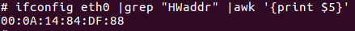

> Fig. 13 - Only MAC address of eth0 interface is printed out on the screen this time

So now a Python function that fetches router's MAC address can be written. Because the function will not differ that much from the get_serial() function, it can be copied with minor changes.


```python
import paramiko

def get_mac():
	cmd = "ifconfig eth0 |grep \"HWaddr\" |awk '{print $5}'"
	ssh_stdin, ssh_stdout, ssh_stderr = ssh.exec_command(cmd)
	outp = ssh_stdout.readlines()
	mac = outp[0].strip()
	return mac
	
router_dflt_ip = "192.168.1.1"
uname = "root"
passwd = "Password3xample-"

ssh = paramiko.SSHClient()
ssh.set_missing_host_key_policy(paramiko.AutoAddPolicy())
ssh.connect(router_dflt_ip, username=uname, password=passwd)

mac = get_mac()
print(mac)

ssh.close()
```

> 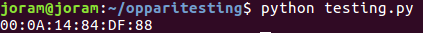

> Fig. 14 - Function get_mac() returns MAC address of router's eth0 interface

This time, when the Python program was run, MAC address was returned as expected. Now there are two working functions that fetch two values of high importancy. Both of the values will be used later in the program, for example, SNMP name will be changed to router's serial number. 

## 4.4 Restoring router's configuration

This is the first phase in which actual changes to router's current configuration are made. Every single router has its own unique configuration file. What makes the file unique are certificates and its VPN IP address. The VPN IP address is also used in the filename when it is created by NDC's server. For example, a typical configuration filename could be "customer_10.240.254.cfg". Now because the filename is unique for every router, it would be a bad idea to put it inside the Python program. It would be time consuming and additional work to change it everytime before the program is run. So, instead of putting the filename inside the code, it will be given as a parameter, so that one number in the file name can easily be changed before re-running the program. To give parameters to a python program, "sys" module needs to be imported.

The syntax for the actual restore command inside the router is as simple as "restore <filename>". But before anything can be restored, the file has to be transferred to the router. Once the file is in the router, "restore <filename>" can be run. It is also a good practice to make sure that the command ran succesfully. If it did, "Configuration succesfully updated." will be printed to standard output. Now, it is possible to use this information to check whether everything went well or awry.


> 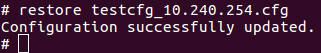

> Fig. 15 - "Configuration succesfully updated." indicates success

Now everything is pretty straightforward, so it can be put into the Python program.


```python
import paramiko
import sys

#takes one parameter, which should be configuration file
#sftp is used to transfer the file to router
#check is made if restore command was succesfully run, return OK or FAILED
def restore_cfg(restore_file):
	orig = restore_f
	dest = "/root/" + restore_file
	cmd = "restore " + dest
	sftp = ssh.open_sftp()
	sftp.put(orig, dest)
	ssh_stdin, ssh_stdout, ssh_stderr = ssh.exec_command(cmd)
	success = "Configuration successfully updated."
	outp = ssh_stdout.readlines()
	status = outp[0].strip()
        if status == success:
                status_msg = "OK"
        else:
                status_msg = "FAILED"
        return status_msg

#first parameter given to program is restore_file
router_dflt_ip = "192.168.1.1"
uname = "root"
passwd = "Password3xample-"
restore_file = sys.argv[1]

ssh = paramiko.SSHClient()
ssh.set_missing_host_key_policy(paramiko.AutoAddPolicy())
ssh.connect(router_dflt_ip, username=uname, password=passwd)

status = router_cfg(restore_file)
print(status)

ssh.close()
```

> 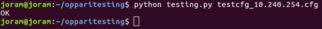

> Fig. 16 - In the Python program, "OK" indicates success

In this case, the program returns "OK" message which translates into "Configuration succesfully updated.". First the file is transferred to the router's /root/ directory, after which the command "restore testcfg_10.240.254.cfg" is run. The status message is caught and later used to determine whether the command was succesful or not.

## 4.5 Changing SNMP name

SNMP settings are changed when the new configuration file is put into use. You may wonder why couldn't the SNMP name be updated to the configuration file just like the other settings? This is because SNMP name needs to be router's serial number and one doesn't know the serial number yet when the configuration files are created. It would be difficult to put this information into the configuration file, and wreak havoc if serial numbers and files get mixed up.

SNMP name configuration can be found under /etc in settings.snmp file.


> 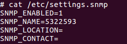

> Fig. 17 - A snippet of settings inside /etc/settings.snmp


There is a great command line tool available to make this kind of change, "sed". "sed" is a really powerful tool escpecially for text editing and data mining.   


> 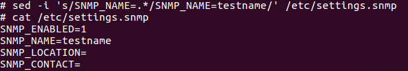

> Fig. 18 - sed makes magic happen


"sed -i 's/SNMP_NAME=.*/SNMP_NAME=testname/' /etc/settings.snmp" (stop cursive*) was run. As it can be seen, SNMP name changed to "testname". Now with the real case, the only difference is that the router's serial number has to be used instead.


```python
import paramiko
import sys

def get_serial():
	cmd = "status -v sys |grep \"Serial Number\" |awk '{print $4}'"
	ssh_stdin, ssh_stdout, ssh_stderr = ssh.exec_command(cmd)
	outp = ssh_stdout.readlines()
	serial = outp[0].strip()
	return serial

#because there's no output in the command, another command is run to check the new SNMP name
def change_snmp(serial):
	cmd = "sed -i 's/SNMP_NAME=.*/SNMP_NAME=" + str(serial) + "/' /etc/settings.snmp"
	check = "sed -n 's/SNMP_NAME=//p' /etc/settings.snmp"
	ssh_stdin, ssh_stdout, ssh_stderr = ssh.exec_command(cmd)
	ssh_stdin, ssh_stdout, ssh_stderr = ssh.exec_command(check)
	outp = ssh_stdout.readlines()
        serialcheck = outp[0].strip()
        if str(serialcheck) == str(serial):
                state = "OK"
        else:
                state = "FAILED"
        return state

router_dflt_ip = "192.168.1.1"
uname = "root"
passwd = "Password3xample-"

ssh = paramiko.SSHClient()
ssh.set_missing_host_key_policy(paramiko.AutoAddPolicy())
ssh.connect(router_dflt_ip, username=uname, password=passwd)

serial = get_serial()
status = change_snmp(serial)
print(status)

ssh.close()
```


> 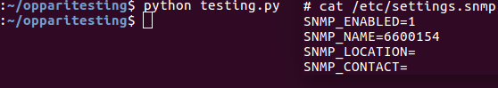

> Fig. 19 - Succesfully changed SNMP name


As it can be seen again, SNMP name has changed. This time the Python program first called get_serial() function to get router's serial number, after which it called change_snmp() function with one argument which was the serial number. Changing SNMP name is not rocket science, but there's always a possibility that something goes wrong. This is the reason why even the simplest change should be verified.

## 4.6 Adding user modules

User modules are third party programs than can be added to routers. User modules are located under /opt directory. User modules are added as .tgz files, which will be decompressed and put into /opt directory. Before decompression is possible, user modules need to be transferred to router. For this, the code for restore_cfg() function can be reused with some changes.


```python
import paramiko
import sys

#sftp is used to transfer user module to router
#.tgz is decompressed to /opt
#check is made to make sure the user module exists
#return OK or FAILED
def add_um(user_m, m_name):
        orig = user_m
        dest = "/opt/" + user_m
        cmd = "tar -xzf " + dest + " -C /opt/"
	check = "if [ -d \"/opt/" + m_name + "\" ];then echo OK;else echo NOT;fi"
        sftp = ssh.open_sftp()
        sftp.put(orig, dest)
        ssh_stdin, ssh_stdout, ssh_stderr = ssh.exec_command(cmd)
	ssh_stdin, ssh_stdout, ssh_stderr = ssh.exec_command(check)
	outp = ssh_stdout.readlines()
        status = outp[0].strip()
        if status == "OK":
                status_msg = "OK"
        else:
                status_msg = "FAILED"
        return status_msg

	

router_dflt_ip = "192.168.1.1"
uname = "root"
passwd = "Password3xample-"
user_m1 = "pinger.v3.tgz"
user_m1_name = "pinger"

ssh = paramiko.SSHClient()
ssh.set_missing_host_key_policy(paramiko.AutoAddPolicy())
ssh.connect(router_dflt_ip, username=uname, password=passwd)

status = add_um(user_m1):
print(status)

ssh.close()
```


> 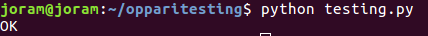

> Fig. 20 - Program returns "OK" status message indicating success


> 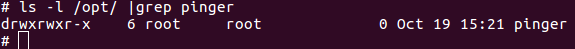

> Fig. 21 - Pinger module can be seen under /opt now

Again, Python program returns "OK" message, so in other words the pinger module has been succesfully transferred to the router. Now this function can be reused as many times as needed to add more user modules.


## 4.7 Changing root password

Having passwords in clear text is always questionable, especially when the root account is concerned. In this case, it was agreed that it is okay as long as only authorized people in NDC have read and write permissions to the program. 

To change root's password without interacting, echo and chpasswd commands combined can be used. The whole command would be "echo 'root:<password>' |chpasswd". If the password was actually changed, status message "Password for 'root' changed" is printed to standard output, which can be caught again and used later to determine whether root's password change was a success or not.


```python
import paramiko
import sys

def change_pw(passwd):
	cmd = "echo 'root:"+ str(passwd) + "' |chpasswd"
	ssh_stdin, ssh_stdout, ssh_stderr = ssh.exec_command(cmd)
	outp = ssh_stdout.readlines()
	status = outp[0].strip()
	success = "Password for 'root' changed"
	if status == success:
		status_msg = "OK"
	else:
		status_msg = "FAILED"
	return status_msg

router_dflt_ip = "192.168.1.1"
uname = "root"
passwd = "Password3xample-"
new_passwd = "Str0ngerandl0nger!-"

ssh = paramiko.SSHClient()
ssh.set_missing_host_key_policy(paramiko.AutoAddPolicy())
ssh.connect(router_dflt_ip, username=uname, password=passwd)

status = change_pwd(new_passwd)
print(status)

ssh.close()
```


> 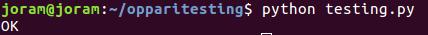

> Fig. 22 - Status message "OK" indicates that the root password was succesfully changed


The root user's password was succesfully changed. Now the actual configuration part of the process is ready, but this is not the end yet. A backup file has to be downloaded and the excel file needs to be updated.

## 4.8 Getting backup file

Now that every configuration is verified, a backup file of the current configuration is needed, it will be stored in NDC's server. The reason why it is needed, is simply because restoring router configuration becomes easy in case if something goes awry. This is part of configuration management. There's command "backup" that can be used to create the backup file. Command "backup" itself just prints router's current configuration to standard output, but it can easily be redirected to a file.


```python
import paramiko
import sys

#takes one argument, configuration filename
#original filename will be preceded by "bckup"
def get_backup(filename):
	bu_file = "bckup" + filename
	cmd = "backup > " + bu_file
	orig = "/root/" + bufile
	ssh_stdin, ssh_stdout, ssh_stderr = ssh.exec_command(cmd)
        sftp = ssh.open_sftp()
        sftp.get(orig, bu_file)

router_dflt_ip = "192.168.1.1"
uname = "root"
passwd = "Password3xample-"
restore_file = sys.argv[1]

ssh = paramiko.SSHClient()
ssh.set_missing_host_key_policy(paramiko.AutoAddPolicy())
ssh.connect(router_dflt_ip, username=uname, password=passwd)

get_backup(restore_file)

ssh.close()
```

> 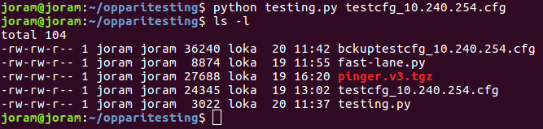

> Fig. 23 - Backup file can be seen in the directory


This time, variable bu_file that contains the actual backup filename is used as the destination address of the file. This means the backup file will be saved under the same directory with the Python program. The next step is to put all the functions and code together. What is really important here, some checks need to be made, such as does every single file exists in the same directory with the Python program.

## 4.9 Catching errors

There are many potential causes of errors. The idea is to get rid of most of them. This makes misuse of the program harder. 

Firstly, the Python program takes one parameter, an error will be raised if there are no parameters at all or more than one.


> 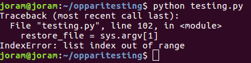

> Fig. 24 - No parameters to the script caused IndexError


Perfect, now the cause of error is known, so it can be prevented in the program! Also, there are bunch of files defined in the code, so making sure the files really exists in the directory is necessary.

> 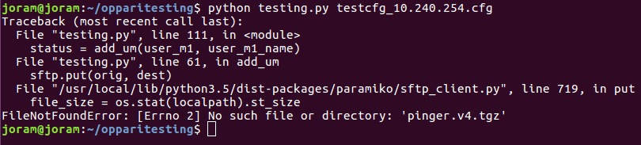

> Fig. 25 - Missing file caused FileNotFoundError


The user module "pinger.v3.tgz" was changed to "pinger.v4.tgz" in the code. Because there is no such a file, FileNotFoundError is raised. Now this can also easily be prevented in the program.

There are still two probable errors that can easily be spotted by just quickly looking at the code. Both are related to the SSH connection. Firstly, when the SSH authentication happens, incorrect credentials will cause an error.


> 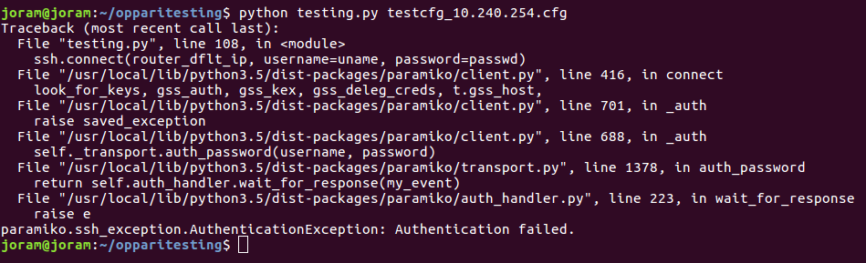

> Fig. 26 - Wrong credentials caused an error


The username "root" was changed to "root1" in the code. Because the user doesn't exists, the credentials are deemed incorrect. This caused paramiko's own AuthenticationException exception to be raised. This will be prevented soon as well! The last probable cause of an error that can easily be spotted is incorrectly configured network settings. The Python program will keep on trying to connect to the router. Because the network settings are incorrect, the router cannot be found and connection is never established.


> 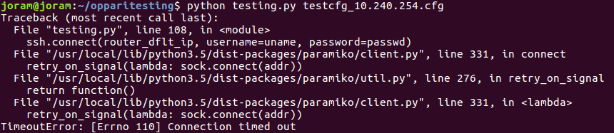

> Fig. 27 - TimeoutError occured


TimeoutError was caused by misconfigured network settings. Anyway, it took a really long time before the exception was raised. Now, it is important to remember that this configuration happens via ethernet cable. Anything more than five seconds indicates that there's something wrong with network settings. Luckily, it is possible to set user defined timeout. Timeout of five seconds should be enough, but it is a good practice to add some room, so timeout will be set to 15 seconds.


> 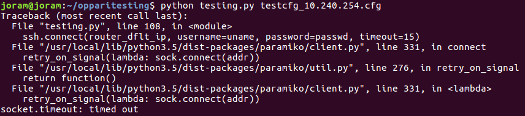

> Fig. 28 - This time timeout was caused by socket


This time TimeoutError exception was not raised. The error was "socket.timeout". To be able to catch this error, module "socket" needs to be imported. Otherwise, NameError will be raised when catching "socket.timeout". Now that it is known what needs to be caught, it is time to strenghten the code and add more logic.


```python
import paramiko
import sys
import socket
import os

router_dflt_ip = "192.168.1.1"
uname = "root"
passwd = "Password3xample-"
new_passwd = "Str0ngerandl0nger!-"
user_m1 = "pinger.v3.tgz"
user_m1_name = "pinger"
user_m2 = "hmpclient.v2.tgz"
user_m2_name = "hmpclient"

#checking that there's one parameter given to the program
try:
	restore_file = sys.argv[1]
except IndexError:
	print("Usage: python autoconfig.py <cfg_file>")
	sys.exit()

#checking if necessary files exist in current working directory
if not os.path.exists(user_m1):
	print("Unable to find user module " + user_m1 + " in current working directory.")
	sys.exit()
	
if not os.path.exists(user_m2):
	print("Unable to find user module " + user_m2 + " in current working directory.")
	sys.exit()
	
if not os.path.exists(restore_file):
	print("Unable to find cfg file " + restore_file + " in current working directory.")
	sys.exit()

#timeout is set to 15 seconds
try:
	ssh = paramiko.SSHClient()
	ssh.set_missing_host_key_policy(paramiko.AutoAddPolicy())
	ssh.connect(router_dflt_ip, username=uname, password=passwd, timeout=15)
#catching misconfigured network settings
except socket.timeout:
	print("Connection timed out. Check your network settings")
	sys.exit()
#catching incorrect credentials
except paramiko.ssh_exception.AuthenticationException:
	print("Authentication error. Check your credentials")
	sys.exit()

serial = get_serial()
mac = get_mac()

print("Serial number: " + str(serial))
print("MAC address: " + mac + "\n")
print("Starting configuration daemon...")

print("Sending configuration file...")
while True:
        restore_status = restore_cfg(restore_file)
        if restore_status == "OK":
                break

print("Changing SNMP name...")
while True:
	snmp_status = change_snmp(serial)
	if snmp_status == "OK":
		break

print("Adding user module " + user_m1 + "...")
while True:
	userm_status1 = add_um(user_m1, user_m1_name)
	if userm_status1 == "OK":
		break

print("Adding user module " + user_m2 + "...")
while True:
	userm_status2 = add_um(user_m2, user_m2_name)
	if userm_status2 == "OK":
		break

print("Changing root's password...\n")
while True:
	pw_status = change_pw(new_passwd)
	if pw_status == "OK":
		break

#creating fancy easily spottable summary
print("Verification summary")
print("----------------------------------")
print("|Configuration file restored: " + restore_status + "|")
print("|SNMP Changed: " + snmp_status + "|")
print("|User module " + user_m1 + ": " + userm_status1 + "|")
print("|User module " + user_m2 + ": " + userm_status2 + "|")
print("|Password changed: " + pw_status + "|")
print("----------------------------------\n")
print("Saving backup configuration file as bckup " + restore_file + "...\n")
get_backup(restore_file)
print("Done. The router can be unplugged now!")

ssh.close()
```


> 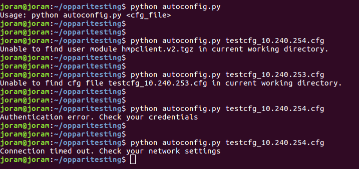

> Fig. 29 - Exceptions were caught correctly


As it can be seen, catching errors works as expected.

> 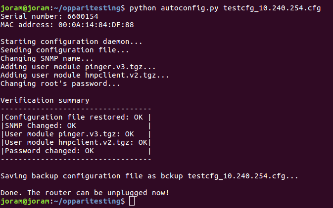

> Fig. 30 - The program ran succesfully


Perfect! The router is configured now. The idea behind the while loops are that the program will keep on trying until it succeeds in a task. There's of course a risk that for some unknown reason it never succeeds and will get stuck in an infinite loop. Some more logic could be added. For example, the program could try three times and if it doesn't succeed, it returns "FAILED" and skips to the next task.

## 4.10 Updating Excel

Now when the router is configured, some information needs to be added to an Excel file. Below is an excel template, which is identical to the original one, just without any data.

> 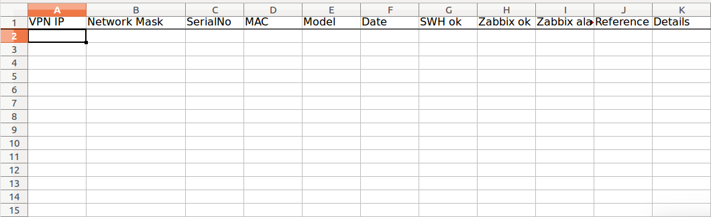

> Fig. 31 - An empty excel template

As it was written earlier, the data which needs to be updated to the excel file is as follows:

- VPN IP address
- Network mask
- Serial Number
- MAC address
- Model
- Date
- Reference

There are also some additional cells, which will be left empty. Those will be updated later if needed. Writing to an excel file with Python is pretty straightforward. In this case, a non-native module "openpyxl" will be used. First, it is time to write the code and test it with test values. If everything goes according to plan, the code can and will be integrated with the router configuration automation program.

```python
import openpyxl

def update_excel():
        #opening excel workbook
        wb = openpyxl.load_workbook(filename = excelfile)

        #opening the first sheet
        sheets = wb.sheetnames
        ws = wb[sheets[0]]

        count = 1
        i = 0

	#titles are located under these columns, on the same line
        letters = ["A", "B", "C", "D", "E", "F", "J"]
        while 1:
                total = letters[i] + str(count)
                valuecheck = ws[total].value
		
		#if a cell is empty, write new value
                if not valuecheck:
                        if letters[i] == "A":
                                ws[total] = fullip
                                print("VPN IP updated to excel")
                        elif letters[i] == "B":
                                ws[total] = mask
                                print("Network mask updated to excel")
                        elif letters[i] == "C":
                                ws[total] = ser
                                print("Serial number updated to excel")
                        elif letters[i] == "D":
                                ws[total] = maci
                                print("MAC address updated to excel")
                        elif letters[i] == "E":
                                ws[total] = model
                                print("Model updated to excel")
                        elif letters[i] == "F":
                                ws[total] = date
                                print("Date updated to excel")
                        elif letters[i] == "J":
                                ws[total] = reference
                                print("Reference updated to excel")
                                break
                        count = 1
                        i += 1
                count += 1

        wb.save(filename = excelfile)

fullip = sys.argv[1]
mask = sys.argv[2]
ser = sys.argv[3]
maci = sys.argv[4]
model = sys.argv[5]
date = sys.argv[6]
reference = sys.argv[7]

excelfile = "customer_router_information.xlsx"

print("Updating excel...\n")
update_excel()

```


> 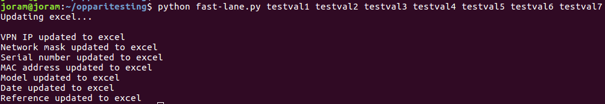

> Fig. 32 - Test values given as parameters


> 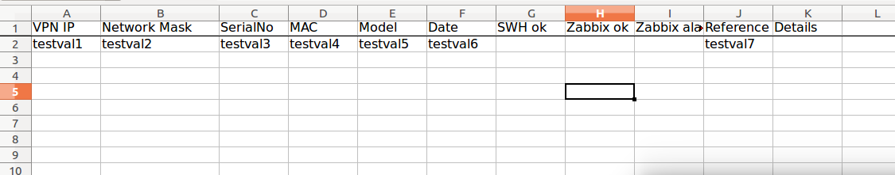

> Fig. 33 - Data is correctly written to the excel file


Okay perfect, it works! The code itself is very straightforward. Locations of title cells are known, every title is on line one, only columns differ. For example, SerialNo which represents serial number, can be found at line one and column C (1C). Now when that is known, the code checks if the cell below is empty. If it is empty, the new value is written into it. If it is not empty, it keeps checking the cells below until it finds an empty one and writes into it. In this test, test values were used and they were given as parameters to the program. Now in the real case when this code is integrated with the router configuration automation program, some of the values can be hardcoded inside the code, some will be provided by the automation program and only few has to be provided as parameters.


## 4.11 Integration

Integration of these two programs is quite simple. Few changes need to be made though. First of all, the fewer parameters that has to be provided, the better. Exact model and reference are something that cannot be found inside the router, which is the reason why the information needs to be given as parameters. Luckily for one batch, both usually stay the same so re-running the program is fast. Also, earlier the configuration filename was provided as a paremeter, to make it simpler, only the IP address part needs to be provided, for example 10.240.254. This way it can easily be used by update_excel() function and also it is easy to turn it into a filename inside the program.

For clarity, only essential parts are showed below. The actual code in its entirety can be found in Appendix.

```python
import paramiko
import sys
import socket
import os
import openpyxl
import time

def get_serial():
	...

def get_mac():
	...

def restore_cfg(restore_file):
	...

def change_snmp(serial):
	...

def add_um(user_m, m_name):
	...

def change_pw(passwd):
	...

def get_backup(filename):
	...
	
def update_excel(ser, maci):
	...
	
#checking that there are three parameter given to the program
try:
	model = sys.argv[1]
	reference = sys.argv[2]
	vpnip = sys.argv[3]
except IndexError:
	print("Usage: python autoconfig.py <model> <reference> <first 3 of VPNIP/xxx.xxx.xxx>")
	sys.exit()
	
router_dflt_ip = "192.168.1.1"
uname = "root"
passwd = "Password3xample-"
new_passwd = "Str0ngerandl0nger!-"
user_m1 = "pinger.v3.tgz"
user_m1_name = "pinger"
user_m2 = "hmpclient.v2.tgz"
user_m2_name = "hmpclient"	
restore_file = "testcfg_" + vpnip + ".cfg"
excelfile = "customer_router_information.xlsx"

#information for update_excel()
mask = "255.255.255.0"
fullip = vpnip + ".1"
date = time.strftime("%d/%m/%Y")

serial = get_serial()
mac = get_mac()

#checkin if excel file exists in current directory
if not os.path.exists(excelfile):
        print("Unable to find excel file " + excelfile + " in current working directory.")
        sys.exit()

#----------other error catching code----------

#----------configuration and print statements----------

update_excel(serial, mac)
```

> 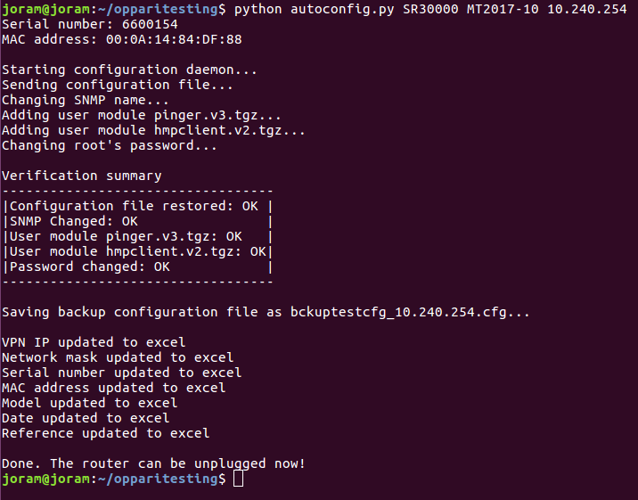

> Fig. 34 - Router succesfully configured and data written to the excel file

> 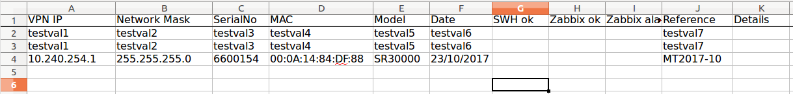

> Fig. 35 - Everything seems to be in their places


Everything works as expected! So, now there's the fully functional code and it can be used in testing and later in production.
- - -

# 5 Results

60 Advantech+BB's SmartFlex LTE routers were configured to make a comparison between manual and automated configuration. 30 of the routers were configured manually, and another 30 by the Python script. Configuration of routers happened in a real production environment, so the results reflect real saved time. A stopwatch was started when the first router was taken out of the box, and stopped when the last configured router was put back into the box. The exact same procedure was applied to the both configuration processes of 30 routers. 

## Manual configuration

Total time from the beginning to the end in seconds was clocked at 7830 (130 minutes 30 seconds). This means the average configuration time of one router is 261 seconds (4 minutes 21 seconds). Rebooting time of SmartFlex routers is approximately 30 seconds, plugging and unplugging and putting it back to the box takes about 5 seconds. This ~35 seconds could be decreased from the configuration time of one router to get the actual configuration time. During this configuration process, two spottable misconfigurations were made, which had to be fixed as well (wrong SNMP name and mixed MAC addresses in excel). 

extras = Excluding rebooting, handling router from/to box, plugging/unplugging

Summary:
- Total time of manual configuration: 2 hours 10 minutes 30 seconds (02:10:30)
- Total time (minus extras): ~1 hour 53 minutes and 0 seconds (01:53:00)
- Average time to configure one router: 4 minutes 21 seconds (00:04:21)
- Average time (minus extras): ~3 minutes 46 seconds (00:03:46)
- Time taken by extras: ~17 minutes 30 seconds (00:17:30)
- Misconfigurations: 2

## Automated configuration

Total time from the beginning to the end in seconds was clocked at 1533 seconds (25 minutes 33 seconds). This means the average configuration time of one router is 51.1 seconds. The same extra time that comes from rebooting, plugging etc. applies here. So the actual time the Python program runs can be calculated by decreasing ~35 seconds from one router's configuration time.

extras = Excluding rebooting, handling router from/to box, plugging/unplugging

Summary:
- Total time of automated configuration: 25 minutes 33 seconds (00:25:33)
- Total time (minus extras): ~8 minutes and 3 seconds (00:08:03)
- Average time to configure one router: 51.1 seconds (00:00:51)
- Average time (minus extras): ~16 seconds (00:00:16)
- Time taken by extras: ~17 minutes 30 seconds (00:17:30)
- Misconfigurations: 0

## Result comparison and summary

Configuration of 30 SmartFlex routers using the Python program saved 01:44:57 hours. It means that the automated method was ~5.2 times faster.

> 

> Fig. 36 - Lots of time can be saved using the Python program


Now if the rebooting time, router handling time from/to box and plugging/unplugging is left out, the actual configuration with the automation program is whopping 14 times faster than manually.

> 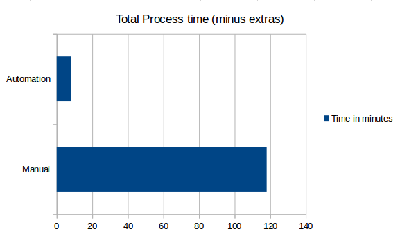

> Fig. 37 - The difference in actual configuration speed is huge

Now the orders are big. Way more than 60 routers have to be configured. The more realistic estimation for a year is 3000-4000 routers. It's time to calculate the estimation of manual and automated configuration times for that batch, based on the results above.

Average configuration time of 1 router (Manual): 261 seconds
Average configuration time of 1 router (Automated): 51 seconds

Estimated configuration time of 4000 routers (Manual): 261 seconds * 4000 = 1 044 000 seconds (~12,1 days)
Estimated configuration time of 4000 routers (Automated): 51 seconds * 4000 = 204 000 seconds (~2,4 days)

If there was just a one person configuring routers, manually it would take over twelve days for the person to finish the configuration process, supposing that the person keeps configuring 24 hours a day, seven days a week. Superman probably doesn't exist, so it's time to make a new estimation. Eight hours is a more realistic working time estimation for a day and will be used here. It means the configuration time can be multiplied by three.

Estimated configuration time of 4000 routers (Manual): ~36.3 days
Estimated configuration time of 4000 routers (Automated): ~7,1 days

So for the one person manual configuration of 4000 routers would take approximately 36 days, while the same process using the autmation program would take only around 7 days. In other words, that would save 29 working days a year, which is more than a month's salary. Supposing the person's salary is 3500 euros a month, NDC would save about 4600 euros a year if the value of a working day was calculated according to the person's salary. In reality though, the work itself can be more valuable by a big margin. Especially considering how much can be done in 29 working days.

Anyway, supposing NDC saves 4600 euros in salaries in a year using the automation program. Probably the person will get raises during the years, let's say so that NDC saves 200 euros more a year using the program. Based on that, the chart below shows how much money could it save in 10 years.


> 

> Fig. 37 - Money saved in 10 years, based on the criteria above

Additionally, one can only wonder how many misconfigurations could be made when configuring 4000 routers manually. It happened twice with the batch of 30. Based on this, ~267 misconfigurations could be calculated for a batch of 4000 routers. This number doesn't even include the possible imperceptible misconfigurations, which may be noticed later. What is more, configuring routers manually can be super tedious. Doing the same thing over and over again. Of course with the automation program, it is also repeating. The difference is, with the automation program, one doesn't have to do many tasks (clicking, browsing, typing) because the program manages them, just run the program. Still most importantly, one doesn't really have to think during the process. Only thing to remember, to check the VPN IP address which is given as a command line parameter and thus is easy and convenient to change before re-running the program. 

- - -

# 6 Future development

There are things that could be improved, both inside and outside the Python program. When configuring the routers with the program, rebooting time is longer than the actual configuration time. This is something that only the manufacturer can change. 

Anyway, now with the program, configuration speed itself is not a problem anymore. Some more checks could be made inside the program though. Currently, it checks if there are three parameters provided or whether all the needed files exists within the same directory. Even if the credentials are wrong or network settings are misconfigured, the program helps to point out the problem. Still, currently the parameters are not checked. The provided parameters could be verified to match desired criteria.

What would be even better, to get rid of parameters. A list of possible hardware models could be made. For each model, a unique feature should be found and based on that the program would choose the correct model from the list. There could also be a list of router configuration files in numeric order. The program could then read the first line of the list, configure the respective router and remove the first line from the list, so the list would be empty after configuring the last router.

Currently one computer configures one router at a time. Hopefully in future, multiple routers could be configured at the same time using the same computer that runs the program. This could be the ultimate goal and would speed up the process a lot more.

- - -

# 7 References

Cisco. (2013). Configuration Guide; Chapter: Using the Command-Line Interface.
	Retrieved from https://www.cisco.com/c/en/us/td/docs/ios/12_2/configfun/configuration/guide/ffun_c/fcf001.html
	
Cisco. (2014). Cisco IOS Scripting with TCL Configuration Guide, Cisco IOS Release 15M&T.
	Retrieved from https://www.cisco.com/c/en/us/td/docs/ios-xml/ios/ios_tcl/configuration/15-mt/ios-tcl-15-mt-book/nm-script-tcl.html

Enck, McDaniel, Sen, Psebos, sspoerel, albert, sanjay, aiello. (2007). Configuration Management at Massive Scale:
	System Design and Experience. 
	Retrieved from https://www.usenix.org/legacy/event/usenix07/tech/full_papers/enck/enck_html/

Ernst, T. & Lach, H-Y. (2007). Network Mobility Support Terminology.
	Retrieved from https://tools.ietf.org/pdf/rfc4885.pdf
	
Finder. (2017). NDC Networks Oy; Taloustiedot. 
	Retrieved from https://www.finder.fi/Internet-palveluja/NDC+Networks+Oy/Espoo/yhteystiedot/159585
	
Glez-Peña, D., Lourenço, A., López-Fernández H., Reboiro-Jato M., Fdez-Riverola F.; Web scraping technologies in an API world, 		Briefings in Bioinformatics, Volume 15, Issue 5, 1 September 2014, Pages 788–797. 
	Retrieved from https://doi.org/10.1093/bib/bbt026 
	
Haddaway, N. (2015). The Use of Web-scraping Software in Searching for Grey Literature. Grey Journal. 11. 186-190.
	Retrieved from 
	https://www.researchgate.net/publication/282658358_The_Use_of_Webscraping_Software_in_Searching_for_Grey_Literature

Heidi, E., (24.03.2016). An Introduction to Configuration Management. 
	Retrieved from https://www.digitalocean.com/community/tutorials/an-introduction-to-configuration-management

Heydon, A. & Nojark, M. (1999). Mercator: A scalable, extensible Web crawler. 
	Retrieved from http://www.bagualu.net/linux/crawler.pdf 

IDC. (2017). IDC's Worldwide Quarterly Ethernet Switch and Router Trackers Show Steady Growth for Q1 2017; Results Bode Well for 	Year Ahead. Retrieved from https://www.idc.com/getdoc.jsp?containerId=prUS42757317

Khan, I. 2014. Cisco Vs Huawei CLI 1-2 (Basic Commands 2). 
	Retrieved from 
	http://www.networksheaven.com/wp-content/gallery/cisco-vs-huawei-cli-commands/ciscovshuaweicli-basiccommands2.jpg

NDC. (2017). Kriittisen tiedonsiirron asiantuntija.
	Retrieved from http://www.ndc.fi/yritys/

- - -

# 8 Appendix

## The source code of autoconfig.py

```python
import paramiko
import sys
import socket
import os
import time
import openpyxl

def get_serial():
	cmd = "status -v sys |grep \"Serial Number\" |awk '{print $4}'"
	ssh_stdin, ssh_stdout, ssh_stderr = ssh.exec_command(cmd)
	outp = ssh_stdout.readlines()
	serial = outp[0].strip()
	return serial

def get_mac():
	cmd = "ifconfig eth0 |grep \"HWaddr\" |awk '{print $5}'"
	ssh_stdin, ssh_stdout, ssh_stderr = ssh.exec_command(cmd)
	outp = ssh_stdout.readlines()
	mac = outp[0].strip()
	return mac

def restore_cfg(restore_file):
	orig = restore_file
	dest = "/root/" + restore_file
	cmd = "restore " + dest
	sftp = ssh.open_sftp()
	sftp.put(orig, dest)
	ssh_stdin, ssh_stdout, ssh_stderr = ssh.exec_command(cmd)
	success = "Configuration successfully updated."
	outp = ssh_stdout.readlines()
	status = outp[0].strip()
	if status == success:
		status_msg = "OK"
	else:
		status_msg = "FAILED"
	return status_msg

def change_snmp(serial):
	cmd = "sed -i 's/SNMP_NAME=.*/SNMP_NAME=" + str(serial) + "/' /etc/settings.snmp"
	check = "sed -n 's/SNMP_NAME=//p' /etc/settings.snmp"
	ssh_stdin, ssh_stdout, ssh_stderr = ssh.exec_command(cmd)
	ssh_stdin, ssh_stdout, ssh_stderr = ssh.exec_command(check)
	outp = ssh_stdout.readlines()
	serialcheck = outp[0].strip()
	if str(serialcheck) == str(serial):
		state = "OK"
	else:
		state = "FAILED"
	return state

def add_um(user_m, m_name):
	orig = user_m
	dest = "/opt/" + user_m
	cmd = "tar -xzf " + dest + " -C /opt/"
	check = "if [ -d \"/opt/" + m_name + "\" ];then echo OK;else echo NOT;fi"
	sftp = ssh.open_sftp()
	sftp.put(orig, dest)
	ssh_stdin, ssh_stdout, ssh_stderr = ssh.exec_command(cmd)
	ssh_stdin, ssh_stdout, ssh_stderr = ssh.exec_command(check)
	outp = ssh_stdout.readlines()
	status = outp[0].strip()
	if status == "OK":
		status_msg = "OK"
	else:
		status_msg = "FAILED"
	return status_msg

def change_pw(passwd):
	cmd = "echo 'root:"+ str(passwd) + "' |chpasswd"
	ssh_stdin, ssh_stdout, ssh_stderr = ssh.exec_command(cmd)
	outp = ssh_stdout.readlines()
	status = outp[0].strip()
	success = "Password for 'root' changed"
	if status == success:
		status_msg = "OK"
	else:
		status_msg = "FAILED"
	return status_msg

def get_backup(filename):
	bu_file = "bckup" + filename
	cmd = "backup > " + bu_file
	orig = "/root/" + bu_file
	ssh_stdin, ssh_stdout, ssh_stderr = ssh.exec_command(cmd)
	sftp = ssh.open_sftp()
	sftp.get(orig, bu_file)

def update_excel(ser, maci):
	#opening excel workbook
	wb = openpyxl.load_workbook(filename = excelfile)

	#opening the first sheet
	sheets = wb.sheetnames
	ws = wb[sheets[0]]

	count = 1
	i = 0

	letters = ["A", "B", "C", "D", "E", "F", "J"]
	while 1:
		total = letters[i] + str(count)
		valuecheck = ws[total].value
		if not valuecheck:
			if letters[i] == "A":
				ws[total] = fullip
				print("VPN IP updated to excel")
			elif letters[i] == "B":
				ws[total] = mask
				print("Network mask updated to excel")
			elif letters[i] == "C":
				ws[total] = ser
				print("Serial number updated to excel")
			elif letters[i] == "D":
				ws[total] = maci
				print("MAC address updated to excel")
			elif letters[i] == "E":
				ws[total] = model
				print("Model updated to excel")
			elif letters[i] == "F":
				ws[total] = date
				print("Date updated to excel")
			elif letters[i] == "J":
				ws[total] = reference
				print("Reference updated to excel")
				break
			count = 1
			i += 1
		count += 1

	wb.save(filename = excelfile)

try:
	model = sys.argv[1]
	reference = sys.argv[2]
	vpnip = sys.argv[3]
except IndexError:
	print("Usage: python autoconfig.py <model> <reference> <first 3 of VPNIP/xxx.xxx.xxx>")
	sys.exit()

router_dflt_ip = "192.168.9.1"
uname = "root"
passwd = "<password>"
new_passwd = "<password>"
user_m1 = "pinger.v3.tgz"
user_m1_name = "pinger"
user_m2 = "hmpclient.v2.tgz"
user_m2_name = "hmpclient"
date = time.strftime("%d/%m/%Y")
excelfile = "customer_router_information.xlsx"
mask = "255.255.255.0"
restore_file = "testcfg_" + vpnip + ".cfg"
fullip = vpnip + ".1"

#checking if necessary files exist in current working directory
if not os.path.exists(user_m1):
	print("Unable to find user module " + user_m1 + " in current working directory.")
	sys.exit()
	
if not os.path.exists(user_m2):
	print("Unable to find user module " + user_m2 + " in current working directory.")
	sys.exit()
	
if not os.path.exists(restore_file):
	print("Unable to find cfg file " + restore_file + " in current working directory.")
	sys.exit()

if not os.path.exists(excelfile):
	print("Unable to find excel file " + excelfile + " in current working directory.")
	sys.exit()

try:
	ssh = paramiko.SSHClient()
	ssh.set_missing_host_key_policy(paramiko.AutoAddPolicy())
	ssh.connect(router_dflt_ip, username=uname, password=passwd, timeout=15)
#catching misconfigured network settings
except socket.timeout:
	print("Connection timed out. Check your network settings")
	sys.exit()
#catching incorrect credentials
except paramiko.ssh_exception.AuthenticationException:
	print("Authentication error. Check your credentials")
	sys.exit()

serial = get_serial()
mac = get_mac()

print("Serial number: " + str(serial))
print("MAC address: " + mac + "\n")
print("Starting configuration daemon...")

print("Sending configuration file...")
while True:
	restore_status = restore_cfg(restore_file)
	if restore_status == "OK":
		break

print("Changing SNMP name...")
while True:
	snmp_status = change_snmp(serial)
	if snmp_status == "OK":
		break

print("Adding user module " + user_m1 + "...")
while True:
	userm_status1 = add_um(user_m1, user_m1_name)
	if userm_status1 == "OK":
		break

print("Adding user module " + user_m2 + "...")
while True:
	userm_status2 = add_um(user_m2, user_m2_name)
	if userm_status2 == "OK":
		break

print("Changing root's password...\n")
while True:
	pw_status = change_pw(new_passwd)
	if pw_status == "OK":
		break

print("Verification summary")
print("----------------------------------")
print("|Configuration file restored: " + restore_status + " |")
print("|SNMP Changed: " + snmp_status + "                |")
print("|User module " + user_m1 + ": " + userm_status1 + "   |")
print("|User module " + user_m2 + ": " + userm_status2 + "|")
print("|Password changed: " + pw_status + "            |")
print("----------------------------------\n")
print("Saving backup configuration file as bckup" + restore_file + "...\n")
get_backup(restore_file)
update_excel(serial, mac)
print("\nDone. The router can be unplugged now!")

ssh.close()
```
## Installing openpyxl and paramiko with pip

```
pip3 install paramiko

pip3 install openpyxl
```
