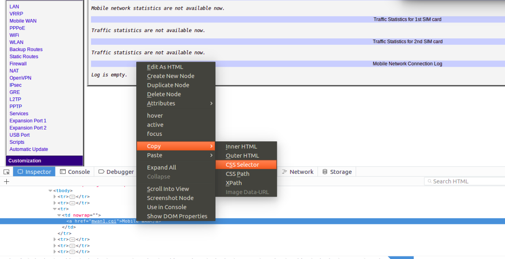
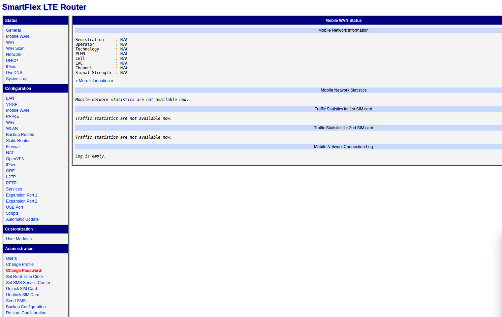

# Thesis - Automation of router configuration

Description text here

* Automation of router configuration
* Name: Joram Puumala
* E-Mail: a1500947@myy.haaga-helia.fi
* Supervisor: Tero Karvinen
* Haaga-Helia University of Applied Sciences
* Keywords: pytnon, vpn, configuration, router, automation

- - -

# Table of Contents

* 1 Introduction
    * 1.1 Background
    * 1.2 About this thesis
    * 1.3 Goals of the study
* 2 Theory/Technologies
	* 2.1 Configuration Management
		* 2.1.1 Configuration Management Systems
	* 2.2 Web Scraping
	* 2.3 Command line configuration
	* 2.4 Data manipulation with Regular Expressions
	* 2.5 Data conversion
* 3 Current state
* 4 Automating the process
	* 4.1 Automatic configuration
	* 4.2 Data extraction
	* 4.3 Data conversion
	* 4.4 Integration
* 5 Results
* 6 Future development
* 7 References
* 8 Appendix

# Introduction

## Background

Router orders are getting bigger, new customers and services are stirring the soup. NDC Networks is facing a serious problem, they are running out of resources. Router configuration by hand is no longer an option.

NDC Networks is a small Finnish company based in Espoo. The company is known for its expertise in networks, Virtual Private Network (VPN) management and router configuration. Routers that technicians at NDC Networks configure are mostly mobile routers. Different mobile routers do exist, but the basic idea is that it can be connected to mobile network using a traditional Subscriber Identity Module (SIM) card and is capable of changing its point of attachment to the Internet, moving from one link to another link (Ernst & Lach, 5). Because of the possible different features and demands though, configurations must be unique for each customer.

## About this thesis

## Goals of the study

Main goal of this study is to find out how to decrease used time and configuration errors in router configuration.

Research questions are:

- What is the best technology/technique to configure a router in this case and why?
- How much time can be saved, automation vs hand?
- How many fewer errors/misconfigurations will occur?

- - -

# Theory/Technologies (change title)

## Configuration technologies

Routers can be configured in different ways, depending on its model and ...

## Configuration management

## Web scraping

Extracting patterned data from web pages in the Internet is called Web scraping. There are different uses for Web scraping, one major use is for businesses to track pricing activities of their competitors. Using Web scraping techniques time and labor can be saved in massive amounts. Web scraping can prove itself useful in the realm of research as well (Haddaway, 1-2).

The basic idea behind a Web scraping framework is that it establishes communication with user defined Web page using the HTTP protocol, which is a stateless text-based Internet protocol designated to coordinate the request-response transactions between a client and a Web server, in which the client is typically a Web browser. The "User-Agent" header also plays a big role, because it tells the server whether it is trying to be accessed by a robot or a browser. Once the Web scraping framework has retrieved the HTML documents using GET method, contents of interest can be extracted. Because extracting the contents of interest is relevant, regular expressions alone or with a combination of additional logic prove to be powerful and thus are widely adapted. Alternative methods include selector-based languages such as XPath and the CSS selector syntax (Glez-Peña, ?).

> 

> Fig. 1 - Copying CSS selector - one of the most used selector-based languages

Web scraping has some downsides too. It is slower than a simple HTTP request to a web server, because browser waits until the whole Web page is loaded before it allows you to access its elements. What is more, the browser generates more network traffic, which is because of the supplementary files being loaded such as image files, JavaScript and CSS, yet they usually don't prove to be useful. One of the biggest issues is that Web pages do change. This may break your code and you have to fix it to make it work again.

## Command line configuration

## Data manipulation with Regular Expressions

## Data conversion

- - -

# Current state

There are currently lots of problems in NDC's router configuration. The greatest problem is that everything is done by hand using router's graphical web user interface. After having finished router configuration in the web GUI, Excel documents need to be updated with information such as router's serialnumber, MAC address, IP address and model, also manually by hand.

> 

> Fig. 2 - Routers' Web Interface

## The current process of router configuration:

1. Plug in the router
2. Browse to its default IP address
3. Log in using username and password
4. Click Restore Configuration
5. Click Add Configuration and browse to the right file
6. Click Add or Update
7. After confirmation takes you to another page, click Back
8. Click Services
9. Click SNMP under Services
10. Change SNMP name
11. Click Apply
12. Click Back
13. Click Change password
14. Type a new password twice
15. Click Apply
16. Click Back
17. Click User Modules
- Currently two user modules are added
18. Click Add new and browse to the right file
19. Click Add or Update
20. Click Back
21. Repeat 18.
22. Repeat 19.
23. Repeat 20.

This is the current process of router configuration by hand. The process includes lots of clicking and browsing, which obviously takes time. Also, chances are that the user does something wrong and it had to be debugged and fixed.

## The current process of updating Excel

1. Write router's VPN IP address
2. Write VPN IP address' netmask
3. Write router's serialnumber
4. Write router's MAC address
5. Write router's model
6. Write current date
7. Write sales reference

The Excel has to be updated after a router is configured, so this process is a part of the whole process.

> 

> Fig. 3 - Excel file in which the information above is stored

- - -

# Automating the process

## Automatic configuration

## Data extraction

## Data Conversion

## Integration

- - -

# Results

- - -

# Future development

- - -

# References

- - -

# Appendix
